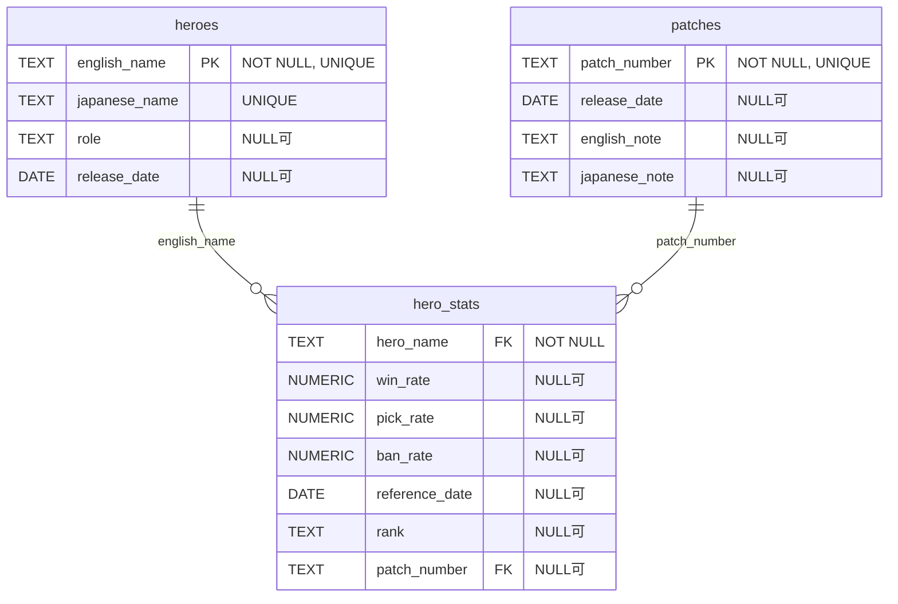

# mlbb.db ER図

## 概要
`mlbb.db`は、Mobile Legends: Bang Bang（MLBB）のヒーロー情報、パッチ情報、およびヒーロー統計データを管理するデータベースです。

## テーブル構造

### heroes テーブル
MLBBのヒーロー基本情報を格納するテーブル

| カラム名 | データ型 | 制約 | 説明 |
|----------|----------|------|------|
| english_name | TEXT | NOT NULL, UNIQUE | ヒーロー英語名（主キー） |
| japanese_name | TEXT | UNIQUE | ヒーロー日本語名 |
| role | TEXT | NULL可 | ヒーローロール（Tank、Fighter、Support等） |
| release_date | DATE | NULL可 | リリース日 |

**レコード数**: 128件

### patches テーブル
ゲームパッチ情報を格納するテーブル

| カラム名 | データ型 | 制約 | 説明 |
|----------|----------|------|------|
| patch_number | TEXT | NOT NULL, UNIQUE | パッチ番号（主キー） |
| release_date | DATE | NULL可 | パッチリリース日 |
| english_note | TEXT | NULL可 | 英語パッチノート |
| japanese_note | TEXT | NULL可 | 日本語パッチノート |

**レコード数**: 1件

### hero_stats テーブル
ヒーローの統計データを格納するテーブル

| カラム名 | データ型 | 制約 | 説明 |
|----------|----------|------|------|
| hero_name | TEXT | NOT NULL, FK | ヒーロー名（heroesテーブル参照） |
| win_rate | NUMERIC | NULL可 | 勝率 |
| pick_rate | NUMERIC | NULL可 | ピック率 |
| ban_rate | NUMERIC | NULL可 | バン率 |
| reference_date | DATE | NULL可 | 統計データ参照日 |
| rank | TEXT | NULL可 | ランク |
| patch_number | TEXT | FK | パッチ番号（patchesテーブル参照） |

**制約**:
- FOREIGN KEY (hero_name) REFERENCES heroes(english_name)
- FOREIGN KEY (patch_number) REFERENCES patches(patch_number)
- UNIQUE (hero_name, reference_date)

**レコード数**: 1,654件

## ER図

## 備考
- `heroes`テーブルは各ヒーローの基本情報を管理
- `patches`テーブルはゲームのバージョン情報を管理
- `hero_stats`テーブルは時系列でヒーローの統計データを記録
- 同一ヒーローの同一日付での重複データは制約により防止
- 外部キー制約により、存在しないヒーローやパッチの統計データは登録不可 