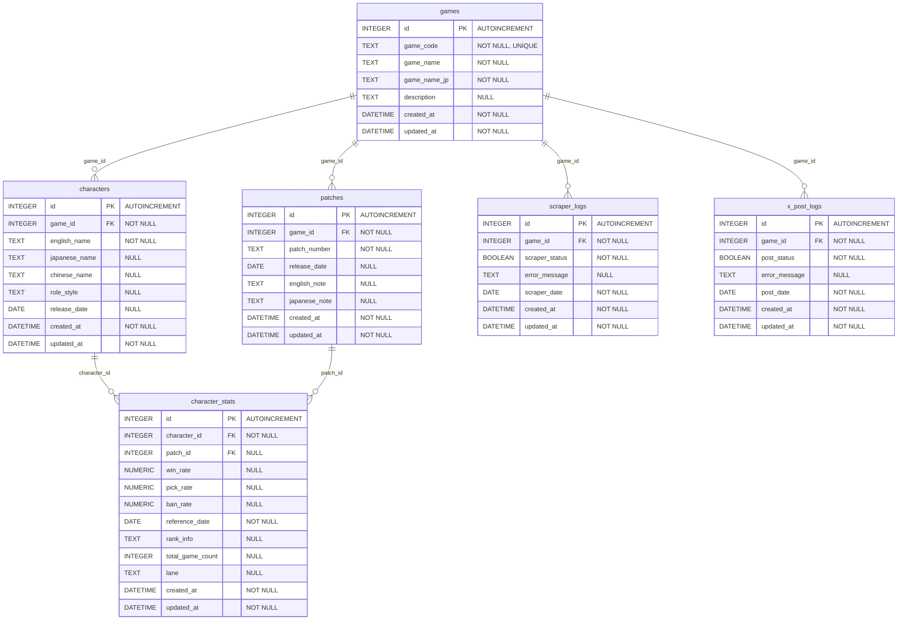

# moba_log.db 統合データベース設計書

## 概要
`moba_log.db`は、MOBAランキングシステムの全データを一箇所に集約した統合データベースです。
4つの既存データベース（moba.db、mlbb.db、unite.db、wildrift.db）のデータを統合し、
ゲーム横断的なデータ管理を可能にします。

## 設計方針
- 全テーブルに`id`（AUTO INCREMENT）、`created_at`、`updated_at`を追加
- ゲーム種別を識別する`game_type`フィールドを追加
- 既存データの互換性を保持
- 正規化を適切に行い、データの整合性を確保

## テーブル構造

### 1. games テーブル
ゲーム基本情報を管理するマスターテーブル

| カラム名 | データ型 | 制約 | 説明 |
|----------|----------|------|------|
| id | INTEGER | PRIMARY KEY AUTOINCREMENT | 自動採番ID |
| game_code | TEXT | NOT NULL, UNIQUE | ゲームコード（'mlbb', 'unite', 'wildrift'） |
| game_name | TEXT | NOT NULL | ゲーム名 |
| game_name_jp | TEXT | NOT NULL | ゲーム名（日本語） |
| description | TEXT | NULL | ゲーム説明 |
| created_at | DATETIME | NOT NULL DEFAULT CURRENT_TIMESTAMP | 作成日時 |
| updated_at | DATETIME | NOT NULL DEFAULT CURRENT_TIMESTAMP | 更新日時 |

**制約**:
- CHECK (game_code IN ('mlbb', 'unite', 'wildrift'))

### 2. characters テーブル
全ゲームのキャラクター基本情報を統合管理

| カラム名 | データ型 | 制約 | 説明 |
|----------|----------|------|------|
| id | INTEGER | PRIMARY KEY AUTOINCREMENT | 自動採番ID |
| game_id | INTEGER | NOT NULL, FK | ゲームID（gamesテーブル参照） |
| english_name | TEXT | NOT NULL | キャラクター英語名 |
| japanese_name | TEXT | NULL | キャラクター日本語名 |
| chinese_name | TEXT | NULL | キャラクター中国語名（Wild Riftのみ） |
| role_style | TEXT | NULL | ロール/スタイル |
| release_date | DATE | NULL | リリース日 |
| created_at | DATETIME | NOT NULL DEFAULT CURRENT_TIMESTAMP | 作成日時 |
| updated_at | DATETIME | NOT NULL DEFAULT CURRENT_TIMESTAMP | 更新日時 |

**制約**:
- FOREIGN KEY (game_id) REFERENCES games(id)
- UNIQUE (game_id, english_name)

### 3. patches テーブル
全ゲームのパッチ情報を統合管理

| カラム名 | データ型 | 制約 | 説明 |
|----------|----------|------|------|
| id | INTEGER | PRIMARY KEY AUTOINCREMENT | 自動採番ID |
| game_id | INTEGER | NOT NULL, FK | ゲームID（gamesテーブル参照） |
| patch_number | TEXT | NOT NULL | パッチ番号 |
| release_date | DATE | NULL | パッチリリース日 |
| english_note | TEXT | NULL | 英語パッチノート |
| japanese_note | TEXT | NULL | 日本語パッチノート |
| created_at | DATETIME | NOT NULL DEFAULT CURRENT_TIMESTAMP | 作成日時 |
| updated_at | DATETIME | NOT NULL DEFAULT CURRENT_TIMESTAMP | 更新日時 |

**制約**:
- FOREIGN KEY (game_id) REFERENCES games(id)
- UNIQUE (game_id, patch_number)

### 4. character_stats テーブル
全ゲームのキャラクター統計データを統合管理

| カラム名 | データ型 | 制約 | 説明 |
|----------|----------|------|------|
| id | INTEGER | PRIMARY KEY AUTOINCREMENT | 自動採番ID |
| character_id | INTEGER | NOT NULL, FK | キャラクターID（charactersテーブル参照） |
| patch_id | INTEGER | NULL, FK | パッチID（patchesテーブル参照） |
| win_rate | NUMERIC | NULL | 勝率 |
| pick_rate | NUMERIC | NULL | ピック率 |
| ban_rate | NUMERIC | NULL | バン率 |
| reference_date | DATE | NOT NULL | 統計データ参照日 |
| rank_info | TEXT | NULL | ランク情報（MLBBのみ） |
| total_game_count | INTEGER | NULL | 総ゲーム数（Uniteのみ） |
| lane | TEXT | NULL | レーン（Wild Riftのみ） |
| created_at | DATETIME | NOT NULL DEFAULT CURRENT_TIMESTAMP | 作成日時 |
| updated_at | DATETIME | NOT NULL DEFAULT CURRENT_TIMESTAMP | 更新日時 |

**制約**:
- FOREIGN KEY (character_id) REFERENCES characters(id)
- FOREIGN KEY (patch_id) REFERENCES patches(id)
- UNIQUE (character_id, reference_date, lane)

### 5. scraper_logs テーブル
スクレイピング処理の実行状況を管理

| カラム名 | データ型 | 制約 | 説明 |
|----------|----------|------|------|
| id | INTEGER | PRIMARY KEY AUTOINCREMENT | 自動採番ID |
| game_id | INTEGER | NOT NULL, FK | ゲームID（gamesテーブル参照） |
| scraper_status | BOOLEAN | NOT NULL | スクレイピング成功/失敗（0: 失敗, 1: 成功） |
| error_message | TEXT | NULL | エラーメッセージ |
| scraper_date | DATE | NOT NULL | スクレイピング実行日 |
| created_at | DATETIME | NOT NULL DEFAULT CURRENT_TIMESTAMP | 作成日時 |
| updated_at | DATETIME | NOT NULL DEFAULT CURRENT_TIMESTAMP | 更新日時 |

**制約**:
- FOREIGN KEY (game_id) REFERENCES games(id)
- CHECK (scraper_status IN (0, 1))

### 6. x_post_logs テーブル
X（旧Twitter）投稿状況を管理

| カラム名 | データ型 | 制約 | 説明 |
|----------|----------|------|------|
| id | INTEGER | PRIMARY KEY AUTOINCREMENT | 自動採番ID |
| game_id | INTEGER | NOT NULL, FK | ゲームID（gamesテーブル参照） |
| post_status | BOOLEAN | NOT NULL | 投稿成功/失敗（0: 失敗, 1: 成功） |
| error_message | TEXT | NULL | エラーメッセージ |
| post_date | DATE | NOT NULL | 投稿実行日 |
| created_at | DATETIME | NOT NULL DEFAULT CURRENT_TIMESTAMP | 作成日時 |
| updated_at | DATETIME | NOT NULL DEFAULT CURRENT_TIMESTAMP | 更新日時 |

**制約**:
- FOREIGN KEY (game_id) REFERENCES games(id)
- CHECK (post_status IN (0, 1))

## ER図



## データ移行マッピング

### 既存データベースから統合データベースへの移行

#### games テーブル初期データ
```sql
INSERT INTO games (game_code, game_name, game_name_jp, description) VALUES
('mlbb', 'Mobile Legends: Bang Bang', 'モバイルレジェンド', 'MOBAゲーム'),
('unite', 'Pokémon UNITE', 'ポケモンユナイト', 'ポケモンMOBAゲーム'),
('wildrift', 'League of Legends: Wild Rift', 'リーグ・オブ・レジェンド ワイルドリフト', 'LOLモバイル版');
```

#### データ移行対応表

| 既存DB | 既存テーブル | 統合テーブル | 備考 |
|--------|-------------|-------------|------|
| mlbb.db | heroes | characters | game_id=1 |
| mlbb.db | patches | patches | game_id=1 |
| mlbb.db | hero_stats | character_stats | rank_info列を使用 |
| unite.db | pokemons | characters | game_id=2 |
| unite.db | patches | patches | game_id=2 |
| unite.db | pokemon_stats | character_stats | total_game_count列を使用 |
| wildrift.db | champions | characters | game_id=3, chinese_name列を使用 |
| wildrift.db | patches | patches | game_id=3 |
| wildrift.db | champion_stats | character_stats | lane列を使用 |
| moba.db | scraper_status | scraper_logs | game_codeからgame_idに変換 |
| moba.db | x_post_status | x_post_logs | game_codeからgame_idに変換 |

## インデックス設計

```sql
-- パフォーマンス向上のためのインデックス
CREATE INDEX idx_characters_game_english ON characters(game_id, english_name);
CREATE INDEX idx_patches_game_patch ON patches(game_id, patch_number);
CREATE INDEX idx_character_stats_character_date ON character_stats(character_id, reference_date);
CREATE INDEX idx_character_stats_patch ON character_stats(patch_id);
CREATE INDEX idx_scraper_logs_game_date ON scraper_logs(game_id, scraper_date);
CREATE INDEX idx_x_post_logs_game_date ON x_post_logs(game_id, post_date);
```

## 統合のメリット

1. **データ一元管理**: 全ゲームのデータを一箇所で管理
2. **ゲーム横断分析**: 複数ゲーム間での比較分析が可能
3. **運用効率化**: データベース管理の簡素化
4. **拡張性**: 新しいゲーム追加時の対応が容易
5. **データ整合性**: 統一されたスキーマによる品質向上

## 注意事項

- 既存データの移行時は、データ型の変換に注意
- `created_at`、`updated_at`は移行時に適切な値を設定
- 外部キー制約により、データの整合性が保証される
- ゲーム固有のフィールド（rank_info、total_game_count、lane）はNULL許可 