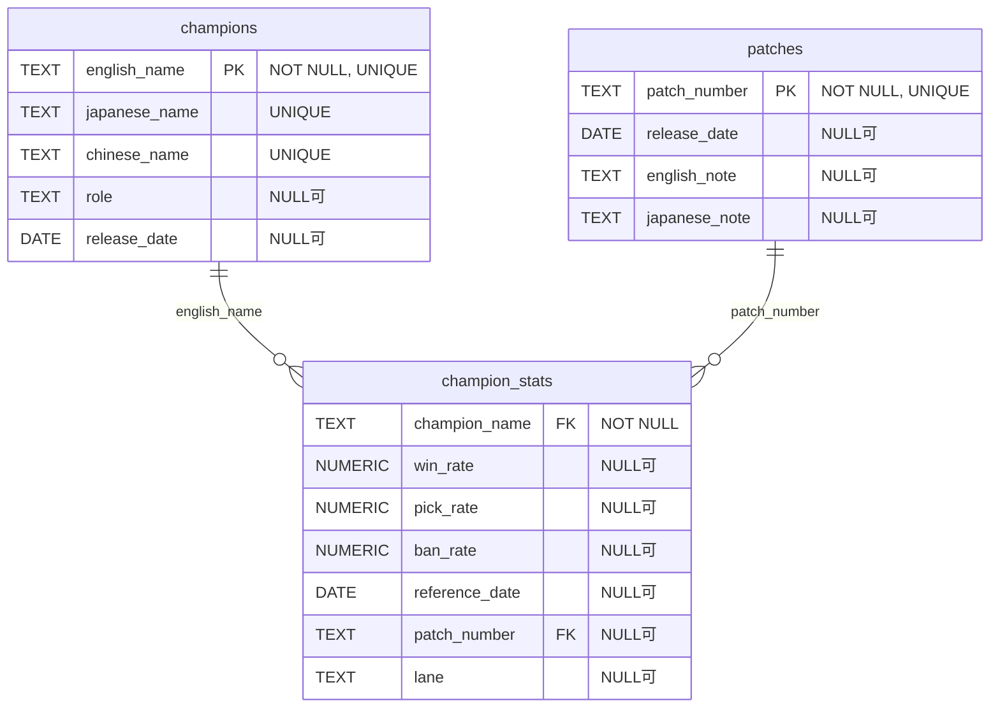

# wildrift.db ER図

## 概要
`wildrift.db`は、League of Legends: Wild Rift（ワイルドリフト）のチャンピオン情報、パッチ情報、およびチャンピオン統計データを管理するデータベースです。

## テーブル構造

### champions テーブル
ワイルドリフトのチャンピオン基本情報を格納するテーブル

| カラム名 | データ型 | 制約 | 説明 |
|----------|----------|------|------|
| english_name | TEXT | NOT NULL, UNIQUE | チャンピオン英語名（主キー） |
| japanese_name | TEXT | UNIQUE | チャンピオン日本語名 |
| chinese_name | TEXT | UNIQUE | チャンピオン中国語名 |
| role | TEXT | NULL可 | チャンピオンロール |
| release_date | DATE | NULL可 | リリース日 |

**レコード数**: 123件

### patches テーブル
ゲームパッチ情報を格納するテーブル

| カラム名 | データ型 | 制約 | 説明 |
|----------|----------|------|------|
| patch_number | TEXT | NOT NULL, UNIQUE | パッチ番号（主キー） |
| release_date | DATE | NULL可 | パッチリリース日 |
| english_note | TEXT | NULL可 | 英語パッチノート |
| japanese_note | TEXT | NULL可 | 日本語パッチノート |

**レコード数**: 3件

### champion_stats テーブル
チャンピオンの統計データを格納するテーブル

| カラム名 | データ型 | 制約 | 説明 |
|----------|----------|------|------|
| champion_name | TEXT | NOT NULL, FK | チャンピオン名（championsテーブル参照） |
| win_rate | NUMERIC | NULL可 | 勝率 |
| pick_rate | NUMERIC | NULL可 | ピック率 |
| ban_rate | NUMERIC | NULL可 | バン率 |
| reference_date | DATE | NULL可 | 統計データ参照日 |
| patch_number | TEXT | FK | パッチ番号（patchesテーブル参照） |
| lane | TEXT | NULL可 | レーン（Top、Jungle、Mid、ADC、Support） |

**制約**:
- FOREIGN KEY (champion_name) REFERENCES champions(english_name) ※スキーマにtypoあり（chamipons）
- FOREIGN KEY (patch_number) REFERENCES patches(patch_number)
- UNIQUE (champion_name, reference_date)

**レコード数**: 7,975件

## ER図

## 備考
- `champions`テーブルは各チャンピオンの基本情報を管理
- 他のゲームと異なり、中国語名（`chinese_name`）フィールドが追加されている
- `patches`テーブルはゲームのバージョン情報を管理（3件のパッチデータ）
- `champion_stats`テーブルは時系列でチャンピオンの統計データを記録
- `lane`フィールドでレーン別の統計を管理（Top、Jungle、Mid、ADC、Support）
- 同一チャンピオンの同一日付での重複データは制約により防止
- 外部キー制約により、存在しないチャンピオンやパッチの統計データは登録不可
- **注意**: スキーマ定義に誤字があります（`chamipons` → `champions`） 