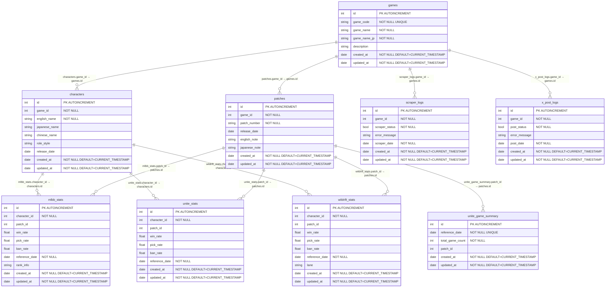

```mermaid
erDiagram
    games {
        int id "PK AUTOINCREMENT"
        string game_code "NOT NULL UNIQUE"
        string game_name "NOT NULL"
        string game_name_jp "NOT NULL"
        string description
        date created_at "NOT NULL DEFAULT=CURRENT_TIMESTAMP"
        date updated_at "NOT NULL DEFAULT=CURRENT_TIMESTAMP"
    }
    characters {
        int id "PK AUTOINCREMENT"
        int game_id "NOT NULL"
        string english_name "NOT NULL"
        string japanese_name
        string chinese_name
        string role_style
        date release_date
        date created_at "NOT NULL DEFAULT=CURRENT_TIMESTAMP"
        date updated_at "NOT NULL DEFAULT=CURRENT_TIMESTAMP"
    }
    patches {
        int id "PK AUTOINCREMENT"
        int game_id "NOT NULL"
        string patch_number "NOT NULL"
        date release_date
        string english_note
        string japanese_note
        date created_at "NOT NULL DEFAULT=CURRENT_TIMESTAMP"
        date updated_at "NOT NULL DEFAULT=CURRENT_TIMESTAMP"
    }
    mlbb_stats {
        int id "PK AUTOINCREMENT"
        int character_id "NOT NULL"
        int patch_id
        float win_rate
        float pick_rate
        float ban_rate
        date reference_date "NOT NULL"
        string rank_info
        date created_at "NOT NULL DEFAULT=CURRENT_TIMESTAMP"
        date updated_at "NOT NULL DEFAULT=CURRENT_TIMESTAMP"
    }
    unite_stats {
        int id "PK AUTOINCREMENT"
        int character_id "NOT NULL"
        int patch_id
        float win_rate
        float pick_rate
        float ban_rate
        date reference_date "NOT NULL"
        date created_at "NOT NULL DEFAULT=CURRENT_TIMESTAMP"
        date updated_at "NOT NULL DEFAULT=CURRENT_TIMESTAMP"
    }
    unite_game_summary {
        int id "PK AUTOINCREMENT"
        date reference_date "NOT NULL UNIQUE"
        int total_game_count "NOT NULL"
        int patch_id
        date created_at "NOT NULL DEFAULT=CURRENT_TIMESTAMP"
        date updated_at "NOT NULL DEFAULT=CURRENT_TIMESTAMP"
    }
    wildrift_stats {
        int id "PK AUTOINCREMENT"
        int character_id "NOT NULL"
        int patch_id
        float win_rate
        float pick_rate
        float ban_rate
        date reference_date "NOT NULL"
        string lane
        date created_at "NOT NULL DEFAULT=CURRENT_TIMESTAMP"
        date updated_at "NOT NULL DEFAULT=CURRENT_TIMESTAMP"
    }
    scraper_logs {
        int id "PK AUTOINCREMENT"
        int game_id "NOT NULL"
        bool scraper_status "NOT NULL"
        string error_message
        date scraper_date "NOT NULL"
        date created_at "NOT NULL DEFAULT=CURRENT_TIMESTAMP"
        date updated_at "NOT NULL DEFAULT=CURRENT_TIMESTAMP"
    }
    x_post_logs {
        int id "PK AUTOINCREMENT"
        int game_id "NOT NULL"
        bool post_status "NOT NULL"
        string error_message
        date post_date "NOT NULL"
        date created_at "NOT NULL DEFAULT=CURRENT_TIMESTAMP"
        date updated_at "NOT NULL DEFAULT=CURRENT_TIMESTAMP"
    }
    games ||--o{ characters : "characters.game_id → games.id"
    games ||--o{ patches : "patches.game_id → games.id"
    patches ||--o{ mlbb_stats : "mlbb_stats.patch_id → patches.id"
    characters ||--o{ mlbb_stats : "mlbb_stats.character_id → characters.id"
    patches ||--o{ unite_stats : "unite_stats.patch_id → patches.id"
    characters ||--o{ unite_stats : "unite_stats.character_id → characters.id"
    patches ||--o{ unite_game_summary : "unite_game_summary.patch_id → patches.id"
    patches ||--o{ wildrift_stats : "wildrift_stats.patch_id → patches.id"
    characters ||--o{ wildrift_stats : "wildrift_stats.character_id → characters.id"
    games ||--o{ scraper_logs : "scraper_logs.game_id → games.id"
    games ||--o{ x_post_logs : "x_post_logs.game_id → games.id"
```