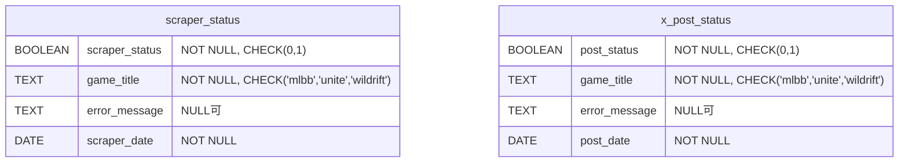

# moba.db ER図

## 概要
`moba.db`は、MOBAゲーム（mlbb、unite、wildrift）のスクレイピング状況とX投稿状況を管理するデータベースです。

## テーブル構造

### scraper_status テーブル
スクレイピング処理の実行状況を記録するテーブル

| カラム名 | データ型 | 制約 | 説明 |
|----------|----------|------|------|
| scraper_status | BOOLEAN | NOT NULL, CHECK(0 or 1) | スクレイピング成功/失敗 (0: 失敗, 1: 成功) |
| game_title | TEXT | NOT NULL, CHECK('mlbb', 'unite', 'wildrift') | ゲームタイトル |
| error_message | TEXT | NULL可 | エラーメッセージ |
| scraper_date | DATE | NOT NULL | スクレイピング実行日 |

**レコード数**: 237件

### x_post_status テーブル
X（旧Twitter）への投稿状況を記録するテーブル

| カラム名 | データ型 | 制約 | 説明 |
|----------|----------|------|------|
| post_status | BOOLEAN | NOT NULL, CHECK(0 or 1) | 投稿成功/失敗 (0: 失敗, 1: 成功) |
| game_title | TEXT | NOT NULL, CHECK('mlbb', 'unite', 'wildrift') | ゲームタイトル |
| error_message | TEXT | NULL可 | エラーメッセージ |
| post_date | DATE | NOT NULL | 投稿実行日 |

**レコード数**: 26件

## ER図

## 備考
- 両テーブルは独立しており、直接的な外部キー関係はありません
- `game_title`フィールドで3つのゲーム（mlbb、unite、wildrift）を区別しています
- エラーが発生した場合、`error_message`にエラー内容が記録されます
- 日付フィールドで処理の履歴を追跡できます 