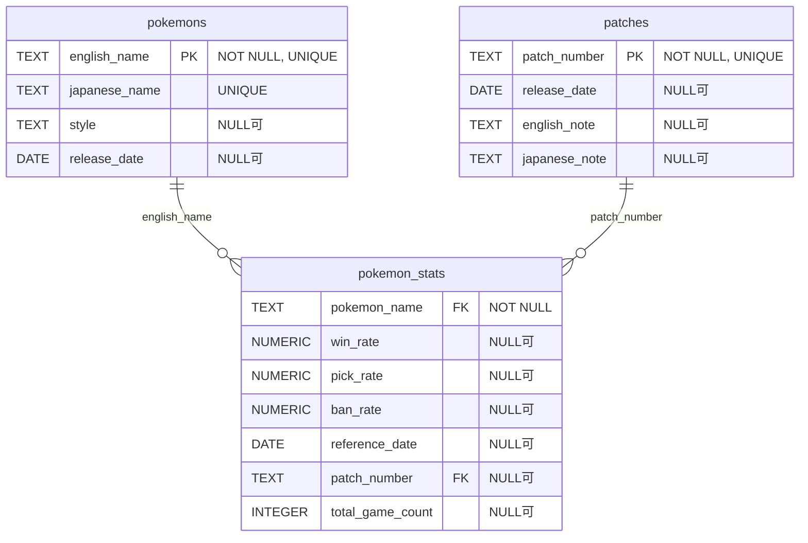

# unite.db ER図

## 概要
`unite.db`は、Pokémon UNITE（ポケモンユナイト）のポケモン情報、パッチ情報、およびポケモン統計データを管理するデータベースです。

## テーブル構造

### pokemons テーブル
ポケモンユナイトのポケモン基本情報を格納するテーブル

| カラム名 | データ型 | 制約 | 説明 |
|----------|----------|------|------|
| english_name | TEXT | NOT NULL, UNIQUE | ポケモン英語名（主キー） |
| japanese_name | TEXT | UNIQUE | ポケモン日本語名 |
| style | TEXT | NULL可 | ポケモンスタイル（All-Rounder、Attacker等） |
| release_date | DATE | NULL可 | リリース日 |

**レコード数**: 72件

### patches テーブル
ゲームパッチ情報を格納するテーブル

| カラム名 | データ型 | 制約 | 説明 |
|----------|----------|------|------|
| patch_number | TEXT | NOT NULL, UNIQUE | パッチ番号（主キー） |
| release_date | DATE | NULL可 | パッチリリース日 |
| english_note | TEXT | NULL可 | 英語パッチノート |
| japanese_note | TEXT | NULL可 | 日本語パッチノート |

**レコード数**: 1件

### pokemon_stats テーブル
ポケモンの統計データを格納するテーブル

| カラム名 | データ型 | 制約 | 説明 |
|----------|----------|------|------|
| pokemon_name | TEXT | NOT NULL, FK | ポケモン名（pokemonsテーブル参照） |
| win_rate | NUMERIC | NULL可 | 勝率 |
| pick_rate | NUMERIC | NULL可 | ピック率 |
| ban_rate | NUMERIC | NULL可 | バン率 |
| reference_date | DATE | NULL可 | 統計データ参照日 |
| patch_number | TEXT | FK | パッチ番号（patchesテーブル参照） |
| total_game_count | INTEGER | NULL可 | 総ゲーム数 |

**制約**:
- FOREIGN KEY (pokemon_name) REFERENCES pokemons(english_name)
- FOREIGN KEY (patch_number) REFERENCES patches(patch_number)
- UNIQUE (pokemon_name, reference_date)

**レコード数**: 648件

## ER図

## 備考
- `pokemons`テーブルは各ポケモンの基本情報を管理
- `patches`テーブルはゲームのバージョン情報を管理
- `pokemon_stats`テーブルは時系列でポケモンの統計データを記録
- MLBBと異なり、`total_game_count`フィールドが追加されている
- 同一ポケモンの同一日付での重複データは制約により防止
- 外部キー制約により、存在しないポケモンやパッチの統計データは登録不可 